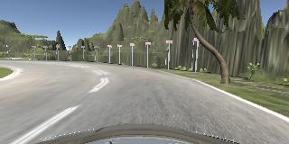
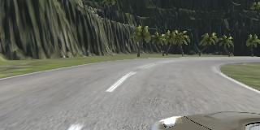

# **Behavioral Cloning** 

## Writeup Template

---

**Behavioral Cloning Project**

The goals / steps of this project are the following:
* Use the simulator to collect data of good driving behavior
* Build, a convolution neural network in Keras that predicts steering angles from images
* Train and validate the model with a training and validation set
* Test that the model successfully drives around track one without leaving the road
* Summarize the results with a written report


[//]: # (Image References)

[image1]: ./examples/placeholder.png "Model Visualization"
[image2]: ./examples/placeholder.png "Grayscaling"
[image3]: ./examples/placeholder_small.png "Recovery Image"
[image4]: ./examples/placeholder_small.png "Recovery Image"
[image5]: ./examples/placeholder_small.png "Recovery Image"
[image6]: ./examples/placeholder_small.png "Normal Image"
[image7]: ./examples/placeholder_small.png "Flipped Image"
[nvidia_architecture]: https://developer.nvidia.com/blog/parallelforall/wp-content/uploads/2016/08/cnn-architecture-624x890.png "NVIDIA Architecture"

## Rubric Points
### Here I will consider the [rubric points](https://review.udacity.com/#!/rubrics/432/view) individually and describe how I addressed each point in my implementation.  

---
### Files Submitted & Code Quality

#### 1. Submission includes all required files and can be used to run the simulator in autonomous mode

My project includes the following files:
* model.py containing the script to create and train the model
* drive.py for driving the car in autonomous mode
* model.h5 containing a trained convolution neural network 
* writeup_report.md or writeup_report.pdf summarizing the results

#### 2. Submission includes functional code
Using the Udacity provided simulator and my drive.py file, the car can be driven autonomously around the track by executing 
```sh
python drive.py model.h5
```

#### 3. Submission code is usable and readable

The model.py file contains the code for training and saving the convolution neural network. The file shows the pipeline I used for training and validating the model, and it contains comments to explain how the code works.

### Model Architecture and Training Strategy

#### 1. An appropriate model architecture has been employed

My model consists of a convolution neural network with 3x3 and 5x5 filter sizes and depths between 24 and 65 (model.py lines 111-115) 

The model includes RELU layers to introduce nonlinearity (lines 111-115 and 117-119), and the data is normalized in the model using a Keras lambda layer (code line 109). 

#### 2. Attempts to reduce overfitting in the model

The model was trained and validated on different data sets to ensure that the model was not overfitting (code line 136-137). The model was tested by running it through the simulator and ensuring that the vehicle could stay on the track.

The model has demonstrated decent results on both tracks so no further means were taken to reduce overfitting. 

#### 3. Model parameter tuning

The model used an adam optimizer, so the learning rate was not tuned manually (model.py line 125).

#### 4. Appropriate training data

Training data was chosen to keep the vehicle driving on the road. I used a combination of center lane driving, recovering from the left and right sides of the road and driving in the opposite direction.

For details about how I created the training data, see the next section. 

### Model Architecture and Training Strategy

#### 1. Solution Design Approach

The overall strategy for deriving a model architecture was to to pick some successful existing architecture and build on top of that.

I've picked the NVIDIA [PilotNet](https://arxiv.org/pdf/1704.07911.pdf), referenced in the lectures. It looked promising because it was tested in the real-world vehicle.

In order to gauge how well the model was working, I split my image and steering angle data into a training and validation set. I found that my first model had a low mean squared error on the training set but a high mean squared error on the validation set. This implied that the model was overfitting. 

To combat the overfitting, I have first decided to augment the data set instead of adding the dropout / batch normalization to the model, which proved to be very effective.

#### 2. Final Model Architecture

The final model (model.py lines 109-127) is essentially from NVIDIA [PilotNet paper](https://arxiv.org/pdf/1704.07911.pdf) and has the following architecture:

![alt text][nvidia_architecture]

#### 3. Creation of the Training Set & Training Process

I have recorded the following driving data:

- One lap on track 1 driving forward in the lane center:


- One lap on track 1 driving backward in the lane center:


- One lap on track 1 recovering from the left side and right sides of the road back to center so that the vehicle would learn to steer back to the center if it ends up on the edge of the track:


- One lap on track 2 driving forward in the right lane:



- One lap on track 2 driving backward in the right lane:


I have also performed the following data augmentation steps on each data set image:

- Use images from the left and the right cameras, correcting the steering angle by adding 0.2 to it for the images from the left camera and subtracting 0.2 for the images from the right camera. This dramatically improved the car ability to recover:

| Image                                             | Camera |  Steering angle (rad) |
|---------------------------------------------------|:------:|----------------------:|
|     | center | 0.449                 |
|       | left   | 0.649                 |
|      | right  | 0.249                 |


After the collection process, I had 18250 of data points and 18250 * 6 = 109500 data points after augmentation.


I have also performed the following pre-processing steps on each data set image:

- Normalize image values into [-0.5, 0.5] range - keras `Lambda` layer at line 109 in the model.py.
- Crop top 50 and bottom 20 pixels of the image (this removes the car hood & the scenery across the horizon, which is not very useful for learning) - keras `Cropping2D` layer at line 110 in the model.py.


I finally randomly shuffled the data set and put 20% of the data into a validation set. 

I used this training data for training the model. The validation set helped determine if the model was over or under fitting. The ideal number of epochs was 6 as evidenced by the validation loss, which converged around ~0.018. I used an adam optimizer so that manually training the learning rate wasn't necessary.

#### 4. Note on Track 2

Ideally, the car should also drive in the correct lane (I have assumed the right lane is correct as it's the most widespread). However, due to image flipping, performed during the data augmentation process, the car may sometimes change the lane and drive in the left one. This made me think that I should probably experiment with removing the image flipping step from the data augmentation pipeline & instead collect more data (drive more laps) on the second track.